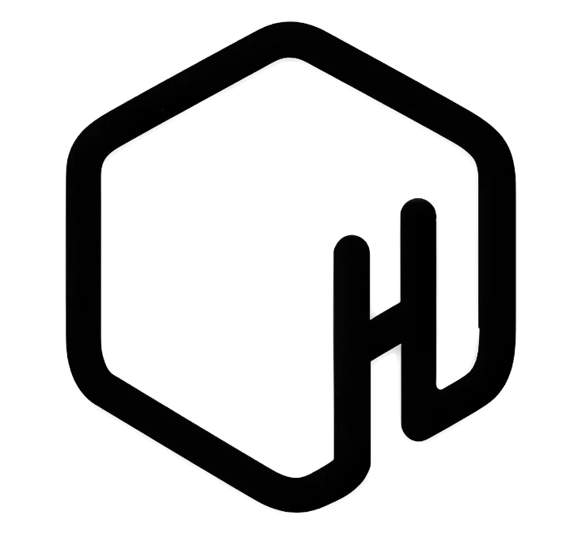
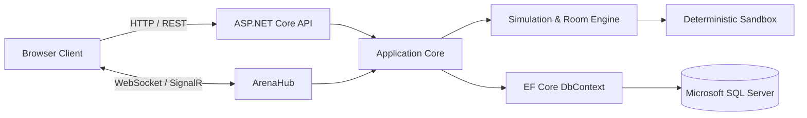

<div align="center">
  
  <h1>RobotArena</h1>
  <p><strong>Real-time algorithmic maze arena & multi-agent tournament platform.</strong></p>
  <p>An esports-grade competition system for autonomous maze-solving agents—powered by .NET 10, SignalR, and SQL Server.</p>

  <p>
    <a href="#quick-start"><strong>Quick start</strong></a>
    ·
    <a href="#main-features">Main features</a>
    ·
    <a href="#architecture">Architecture</a>
    ·
    <a href="#test-accounts">Test accounts</a>
  </p>

  <p>
    
    
    
    
    
    
    
    
  </p>
</div>

---

## Overview

RobotArena is a real-time algorithmic competition platform inspired by international micromouse tournaments. Autonomous software robots navigate unknown, dynamically generated mazes to reach destination targets under strict sensor limits and real-time multiplayer constraints.

The project is architected as a modern monorepo combining a high-performance **.NET 10 backend** (Clean Architecture, ASP.NET Core API, SignalR real-time hubs, Entity Framework Core) with an interactive **React & TypeScript frontend** featuring an in-browser Monaco code studio and deterministic simulation canvas.

### Why RobotArena?

- **Real multiplayer competition**: 2 to 5 concurrent players per room with synchronized start countdowns and live telemetry.
- **Zero-knowledge exploration**: Strict fog-of-war rules prevent robots from accessing global maze topography; agents must perceive, map, and reason solely through localized wall sensors.
- **Fair play & anti-cheat engine**: Code execution runs within isolated sandboxes, statically linted to ban unauthorized DOM, network, and reflection globals.
- **Micro-turn penalty mechanics**: Evaluates shortest path, step count, and directional change penalties to simulate realistic micromouse momentum.
- **Persistent historical records**: All match results, player statistics, and leaderboard standings are stored durably in Microsoft SQL Server.

---

## Main features

| Area | Technical implementation |
| --- | --- |
| Multiplayer matches | Real-time room orchestration, 10-second algorithm selection lock, SignalR state broadcasting |
| Algorithm catalog | Manhattan A*, Penalty-aware A*, Micromouse Flood Fill, Dijkstra, Greedy Best-First, Trémaux DFS Backtracking, Wall Follower |
| Sensor simulation | Local wall proximity (`adjacentWalls`), viable unblocked cells (`availableNeighbors`), destination coordinate (`goal`) |
| In-browser IDE | Embedded Monaco code editor with TypeScript autocompletion, live syntax diagnostics, and local storage persistence |
| Leaderboard & stats | Comprehensive match history, step duration metrics (ms), ELO calculations, and SQL Server persistence |
| Anti-cheat guard | Static AST validation restricting forbidden globals (`eval`, `window`, `document`, `fullMazeMap`) |

---

## Architecture



### Request and event flow

1. **Authentication & Room Registration**: Players authenticate via JWT and join rooms managed in-memory by the .NET `RoomManager`.
2. **Algorithm Strategy Lock**: A synchronized 10-second countdown gives players time to pick or compile their custom algorithm.
3. **Simulation Loop**: The arena executes deterministic tick events, querying player robot logic with localized sensor data.
4. **State Broadcast**: Real-time position updates, fog-of-war reveals, and turn statistics stream to all participants via SignalR.
5. **Score Finalization**: Match summaries, step counts, and winner determinations are saved directly to SQL Server.

---

## Quick start

Run the entire system using **2 terminal windows** from the workspace root:

### Terminal 1: Backend API (.NET 10 & SignalR)

```bash
# Run with Hot-Reload (recompiles automatically on C# file changes)
dotnet watch --project backend/RobotArena.API/RobotArena.API.csproj

# Or use the root package script
pnpm api:watch
```

- API Server: `http://localhost:5200`
- Swagger Documentation: `http://localhost:5200/swagger`
- SignalR Hub: `http://localhost:5200/hub/arena`

> Note: The `RobotArenaDB` database will automatically migrate and initialize on SQL Server during the first backend launch.

### Terminal 2: Frontend Web App (React + Vite)

```bash
# Install workspace dependencies (first run only)
pnpm install

# Start development server
pnpm dev
```

- Web Interface: `http://localhost:3000`

---

## Test accounts

Pre-configured accounts for testing match lobbies and multiplayer simulation:

| Username | Password | Display name | Color |
| :---: | :---: | :--- | :---: |
| `player1` | `123456` | Chuột Bão Tố | Black |
| `player2` | `123456` | Thần Tốc Độ | Red |

---

## Project structure

```text
RobotArena/
├── backend/                       # .NET 10 Clean Architecture Solution
│   ├── RobotArena.API/            # Controllers, SignalR ArenaHub, Swagger docs
│   ├── RobotArena.Application/    # DTOs, RoomManager, business services
│   ├── RobotArena.Domain/         # Domain entities (TaiKhoan, NguoiChoi, TranDau, ThanhTich)
│   ├── RobotArena.Infrastructure/ # EF Core DbContext, SQL Server migrations
│   ├── RobotArena.Simulation/     # Deterministic simulation tick engine
│   └── RobotArena.Sandbox/        # Isolated script execution environment
│
├── frontend/                      # Monorepo pnpm workspace
│   ├── apps/
│   │   └── web/                   # React 18 + Vite SPA, Monaco Editor, Tailwind
│   └── packages/
│       ├── shared-types/          # Shared DTOs between Frontend & Backend
│       ├── simulation-types/      # Sensor definitions, actions, match events
│       └── robot-sdk/             # Official algorithm SDK (@robot-arena/robot-sdk)
│
├── package.json                   # Root workspace scripts
├── pnpm-workspace.yaml            # Monorepo workspace config
├── RobotArena.slnx                # .NET 10 solution file
└── README.md
```

---

## Author

<div align="center">

**NguyenHuuHung**  
GitHub: [@NguyenHuuHung-Dev](https://github.com/NguyenHuuHung-Dev)  
Repository: [https://github.com/NguyenHuuHung-Dev/RobotArena](https://github.com/NguyenHuuHung-Dev/RobotArena)

</div>
